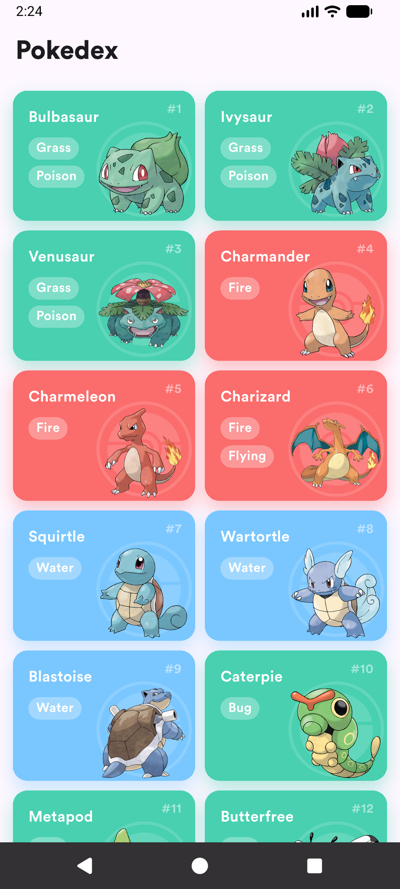
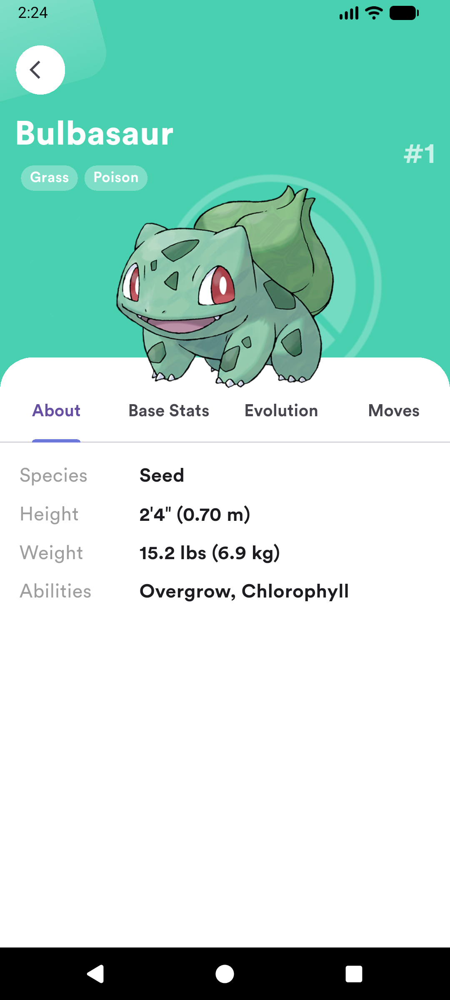
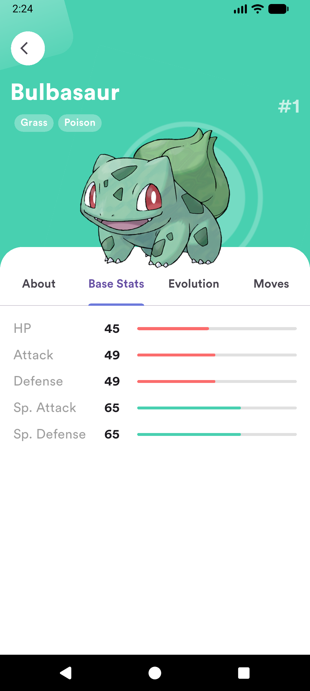
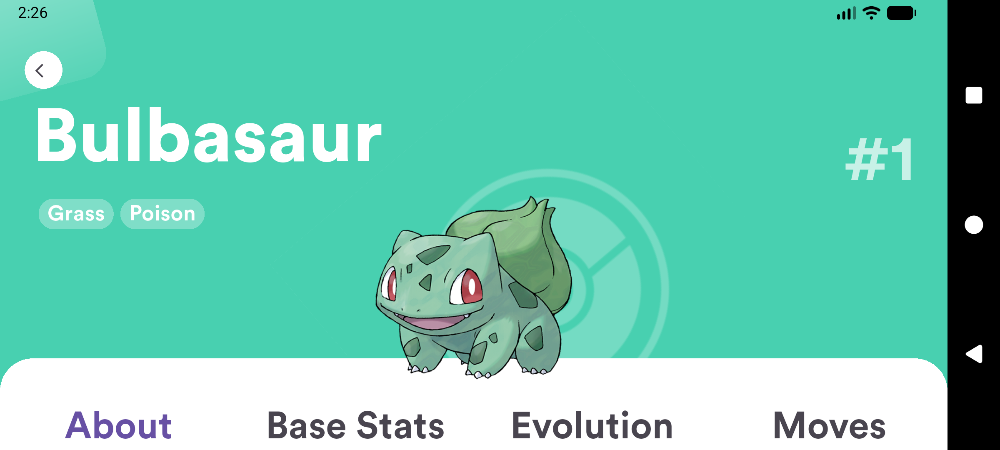
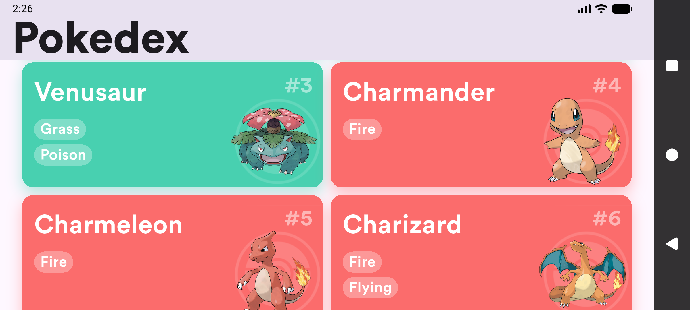
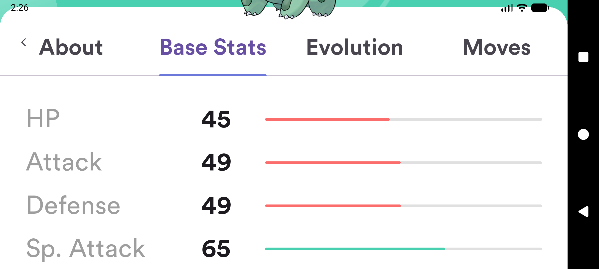

# 📲 Pokedex Sprout

Pokedex Sprout adalah aplikasi **Mobile Pokedex** yang dibuat dengan **Flutter**, menampilkan daftar Pokémon dan detail Pokémon menggunakan data dari **PokeAPI** untuk kebutuhan Technical Test di Sprout.
## 📥 Download APK

👉 [Download APK (v1.0.0)](https://github.com/rezarffahlevi/pokedex_sprout/releases/latest)

> APK ini adalah **Flutter universal APK (~50MB)**.  
> Untuk distribusi Play Store, gunakan AAB agar ukuran install lebih kecil.

---
## 📸 Screenshots

### Pokémon List

### Pokémon Detail

### Landscape Mode

## 🚀 Fitur Utama

✨ **List Pokémon**
- Mengambil list Pokémon dari PokeAPI
- Saat mengambil tipe/detail Pokémon, terdapat Shimmer untuk proses loading
- Menampilkan gambar, nama, dan tipe Pokémon
- Responsive grid sesuai orientasi layar

🔍 **Detail Pokémon**
Tampilan detail dibagi ke beberapa tab:
- **About** — Species, height, weight, abilities
- **Base Stats** — Statistik Pokémon dengan bar visual
- **Moves** — Daftar move yang dipelajari beserta level

📱 **Responsive Portrait & Landscape**
Layout menyesuaikan ukuran dan orientasi layar.

---

## 📊 Penjelasan Teknis Singkat

- Data list Pokémon diambil dari endpoint `/pokemon` menggunakan pagination
- Detail Pokémon diambil setelah dapat list, kemudian diupdate ke list secara realtime
- Species diambil dari endpoint terpisah

## 🧩 Struktur Kode

Struktur project bersifat sederhana dan feature-based:

lib/
- src/
    - bloc/          → State management (Bloc Cubit)
    - models/        → Model data
    - repositories/  → Repositori API / services
    - ui/            → Halaman UI
    - themes/        → Warna, font, aset
    - widgets/       → Komponen UI reusable
    - utils/         → Helper & utilitas

Project ini mengunakan arsitektur MVVM dan dibuat sesimple mungkin, namun tetap menjaga pemisahan concern agar mudah dipahami dan dikembangkan.

---

## 🛠 Cara Menjalankan Project

### Install dependency
flutter pub get

### Jalankan aplikasi
flutter run

---

## 📚 Referensi

- PokeAPI — https://pokeapi.co
¸